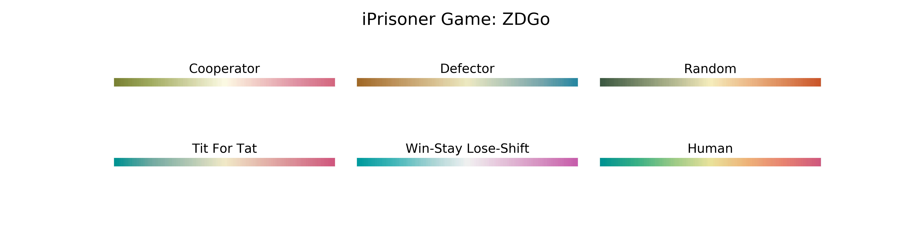

# iPrisoner
## Interactive Prisoner's Dilemma games

### ZDGo

> #### Your strategy

* Cooperator
* Defector
* Random
* Tit For Tat
* Win-Stay Lose-Shift
* Human

> #### Opponent's strategy

* Zero Determinant with an extortion factor $\chi$.

> #### Number of rounds

* $n$

> #### Output

* Scores
  * your score: $s_X$
  * opponent's score: $s_Y$
  
* Frequencies
  * (C, C)
  * (C, D)
  * (D, C)
  * (D, D)
  
> #### Plot
